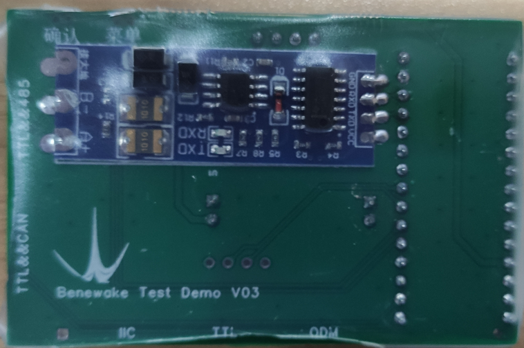
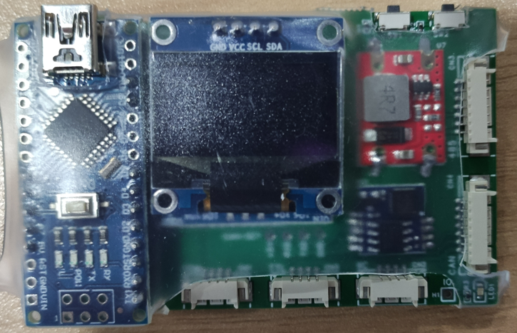
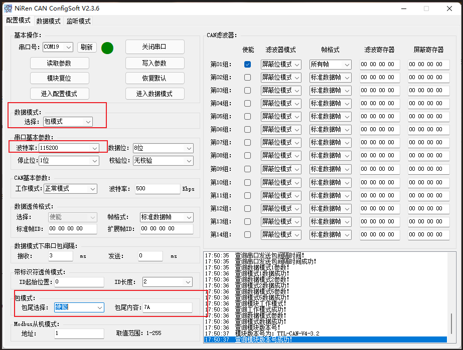

# Benewake_TestDemo
 测试工具

| 20220211 | V1  |                            初版                            |
| :------: | :-: | :-------------------------------------------------------: |
| 20220323 | V2  | 去掉通用数据更新显示、匹配各类产品显示界面、BW_TTL 通用数据更新 |
| 20220424 | V3  |             修正485版本进入不了显示数据界面问题              |
| 20220626 | V4  |                        增加IO口功能                        |

## 2022 - 06 - 26   V4
硬件变更内容：增加IO口功能

## 产品图片

## 模块说明
### TTL-CAN模块
